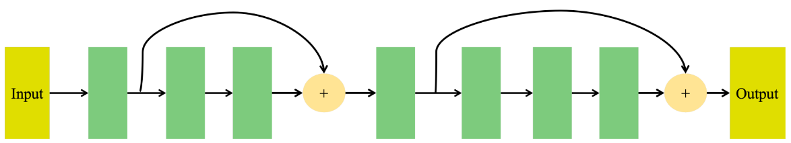

## 1. Weight Increasing
This technique focuses on initializing weights with larger values to increase gradient magnitude during backpropagation. This helps prevent gradients from vanishing across layers, especially when using saturating activation functions like Sigmoid.

To illustrate, we initialize weights using a normal distribution with two different standard deviation (std) settings:

- Std = 1.0 (green)
- Std = 10.0 (blue)


## 2. Better Activation
This technique focuses on replacing activation functions in the network with more advanced ones. These functions help mitigate saturation issues, allowing gradients to maintain reasonable values across layers.

In this experiment, we replace all Sigmoid activations in the baseline model with ReLU. Additionally, the weights in Linear layers are initialized with a smaller standard deviation (std = 0.05) to better align with ReLU's properties.


## 3. Better Optimizer
Choosing an appropriate optimization algorithm can significantly improve the Vanishing Gradient Problem by ensuring a more adaptive and stable gradient update during backpropagation.

In this experiment, we replace SGD with Adam, a more advanced optimizer capable of automatically adjusting the learning rate, allowing better gradient flow and reducing vanishing effects.

## 4. Normalize Inside Network
Batch Normalization is a widely used technique to maintain stable input distributions across layers, preventing gradients from vanishing or exploding. This technique also helps accelerate convergence and improves the generalization capability of the model.

In this experiment, we test two normalization methods:

**(a) Standard Batch Normalization**
Batch Normalization is applied to stabilize the output distribution of each layer, keeping values within a stable range and improving convergence speed. Here, we implement nn.BatchNorm1d and apply it after each Linear layer in our baseline model. This helps prevent saturation and maintain consistent gradient flow across layers. 


**(b) Customized Normalization Layer**
Instead of using the standard BatchNorm layer, we implement a custom normalization class as follows:
```python
class MyNormalization(nn.Module):
    def __init__(self):
        super().__init__()

    def forward(self, x):
        mean = torch.mean(x)
        std = torch.std(x)
        return (x - mean) / std

```
## 5. Skip Connection
Choosing an appropriate optimization algorithm can significantly improve the Vanishing Gradient Problem by ensuring a more adaptive and stable gradient update during backpropagation.

In this experiment, we replace SGD with Adam, a more advanced optimizer capable of automatically adjusting the learning rate, allowing better gradient flow and reducing vanishing effects.


## 6. Train Layers Separately (Fine-tuning)
In very deep networks, training all layers at once can lead to low efficiency due to the Vanishing Gradient problem. By training only specific layers first, the model can focus on learning important features without being affected by deeper layers.

This technique is implemented by constructing smaller sub-models, each corresponding to a specific number of layers, and gradually increasing the number of layers trained.


## 7. Gradient Normalization
Gradient Normalization is a technique aimed at stabilizing gradient flow during backpropagation. This method ensures that gradients remain within a reasonable range, preventing them from becoming too small (vanishing) or too large (exploding), thereby improving the learning process of deeper layers in the network.

In this experiment, we implement a GradientNormalizationLayer, utilizing PyTorch's autograd mechanism to normalize gradients during backpropagation. Specifically, gradients are adjusted by normalizing them based on their mean and standard deviation, ensuring that values do not diminish or explode.


# **Overview of Implemented Methods**

| Method                         | Description  | Implementation  |
|--------------------------------|-------------|----------------|
| `1. Weight Increasing`        | Adjusts weight initialization to prevent shrinking gradients by increasing initial weight values. | [Weight Increasing with std = 1.0](https://www.kaggle.com/code/tsunmm/vanishing-gradient-weight-increasing-ver-1) <br> [Weight Increasing with std = 10.0](https://www.kaggle.com/code/tsunmm/vanishing-gradient-weight-increasing-ver-2) |
| `2. Better Activation`        | Replaces traditional activation functions (e.g., Sigmoid) with advanced functions like ReLU to mitigate saturation issues and maintain stable gradients. | [Better Activation](https://your-kaggle-link.com) |
| `3. Better Optimizer`         | Uses advanced optimizers like Adam instead of SGD to dynamically adjust the learning rate and stabilize gradient updates. | [Better Optimizer](https://your-kaggle-link.com) |
| `4. Normalize Inside Network` | Applies Batch Normalization or a custom normalization layer to keep activations within a stable range, improving convergence speed. | [Normalize Inside Network](https://your-kaggle-link.com) |
| `5. Skip Connection`          | Implements ResNet-style skip connections to allow gradients to bypass multiple layers, reducing the risk of vanishing gradients. | [Skip Connection](https://your-kaggle-link.com) |
| `6. Train Layers Separately`  | Uses layer-wise training (fine-tuning) by gradually adding layers to stabilize training and enhance feature learning. | [Train Layers Separately](https://your-kaggle-link.com) |
| `7. Gradient Normalization`   | Normalizes gradients during backpropagation to prevent vanishing/exploding gradients and improve learning in deeper layers. | [Gradient Normalization](https://your-kaggle-link.com) |
